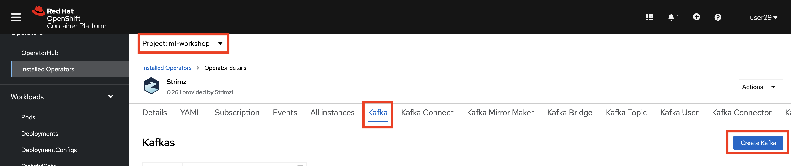
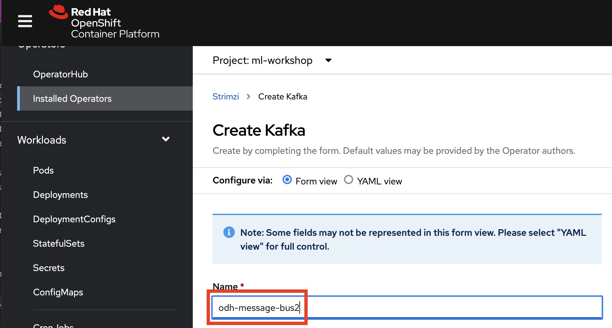

# Kafka Populator

## Overview
This is a supporting application to the [ODH Labs Customer Churn AI/ML Workshop](https://github.com/odh-labs/ml-workshop). It is a utility to be used in case there are issues with the [Churn Workshop's Kafka Populator](https://github.com/odh-labs/ml-workshop/blob/main/src/deploy/kfdef/workshop-kfdef-kafka-and-populator-only.yaml). If you encounter issues, you can use this utility instead.

It uses a Kubernetes job that employs a Docker image that loops through a CSV file [like the one in the Churn repo](https://raw.githubusercontent.com/odh-labs/ml-workshop/main/data-files/products/Customer-Churn_P2.csv) and pushes a JSON representaion of each row to Kafka. That Kafka
- has a Cluster called *odh-message-bus2*
- and a Topic called *datatelco2*

## Instructions

- First Login to OpenShift.
- Visit **Operators > Operator Hub** and search for *Strimzi*
- Install the *Strimzi Community Operator* - going with all the defaults
- Select the *ml-workshop* project on the top of the screen, which you should have created in the [main install process](https://github.com/odh-labs/ml-workshop/blob/main/docs/lab-setup-new.md)
- Navigate to **Operators > Installed Operators** and open the installed *Strimzi* operator
- Click *Kafka* then *Create Kafka*

- Name the Kakfa *odh-message-bus2* (the original one is called *odh-message-bus*)

Should you wish to name these differently, change line 14 of the [Dockerfile](https://github.com/tnscorcoran/bash-to-populate-kafka-topic/Dockerfile)

