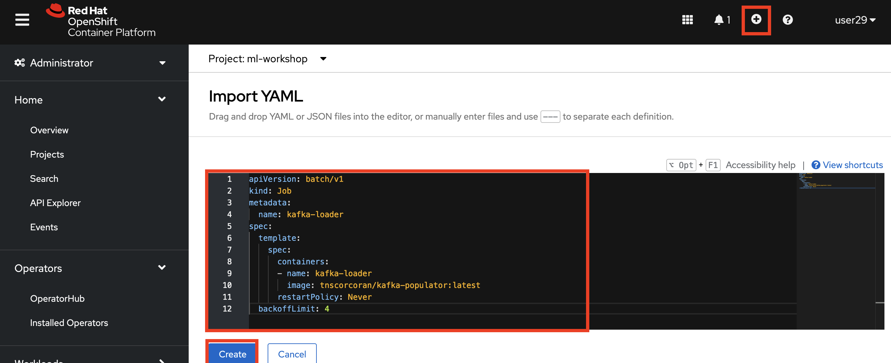

# Kafka Populator

## Overview
This is a supporting application to the [ODH Labs Customer Churn AI/ML Workshop](https://github.com/odh-labs/ml-workshop). It is a utility to be used in case there are issues with the [Churn Workshop's Kafka Populator](https://github.com/odh-labs/ml-workshop/blob/main/src/deploy/kfdef/workshop-kfdef-kafka-and-populator-only.yaml). If you encounter issues, you can use this utility instead.

It uses a Kubernetes job that employs a Docker image that loops through a CSV file [like the one in the Churn repo](https://raw.githubusercontent.com/odh-labs/ml-workshop/main/data-files/products/Customer-Churn_P2.csv) and pushes a JSON representaion of each row to Kafka. That Kafka
- has a Cluster called *odh-message-bus2*
- and a Topic called *datatelco2*


## Instructions

- First Login to OpenShift.
- Visit **Operators > Operator Hub** and search for *Strimzi*
- Install the *Strimzi Community Operator* - going with all the defaults
- Select the *ml-workshop* project on the top of the screen, which you should have created in the [main install process](https://github.com/odh-labs/ml-workshop/blob/main/docs/lab-setup-new.md)
- Navigate to **Operators > Installed Operators** and open the installed *Strimzi* operator
- Click *Kafka* then *Create Kafka*


- Name the Kakfa **odh-message-bus2** (the original one is called **odh-message-bus**)


- Click *Kafka Topic* then *Create Kafka Topic*


- Enter the following for Name and Labels respectively and Click the **Create** button at the bottom of the screen.

```
datatelco2
strimzi.io/cluster=odh-message-bus2
```


Should you wish to name the Kafka and Kafka Topic differently, change line 14 of the [Dockerfile](https://github.com/tnscorcoran/bash-to-populate-kafka-topic/blob/main/Dockerfile) and follow the instructions below, to **Build your own Image**


Next, in OpenShift, with your *ml-workshop* project selected, click the + icon then copy and paste the contents of [job.yaml](https://github.com/tnscorcoran/bash-to-populate-kafka-topic/blob/main/job.yaml) into the free text area and click **Create**


This will begin an approximate 2 hour duration job that will populte the requisite 7000+ records on Kafka.

After a couple of hours, navigate to **Workloads > Jobs** and your *Kafka Loader* job should have completed as shown.


If not, drill into the job and selected Pods -- then examine the pod logs to see what's going on.

Now to verify that your job ran correctly and Kafka did populate, open in a terminal in pod **odh-message-bus2-kafka-0** and run the following
```
cd /opt/kafka/bin
./kafka-console-consumer.sh --bootstrap-server odh-message-bus2-kafka-bootstrap:9092 --topic datatelco2 --from-beginning
```

You should see about 7000 JSON records streaming past you.


